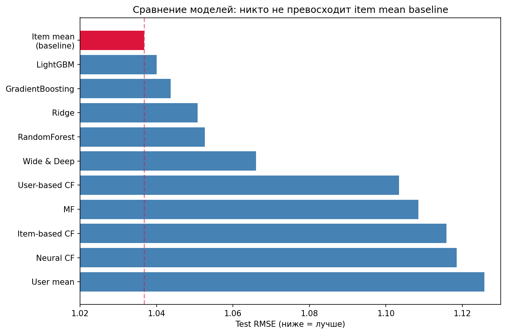
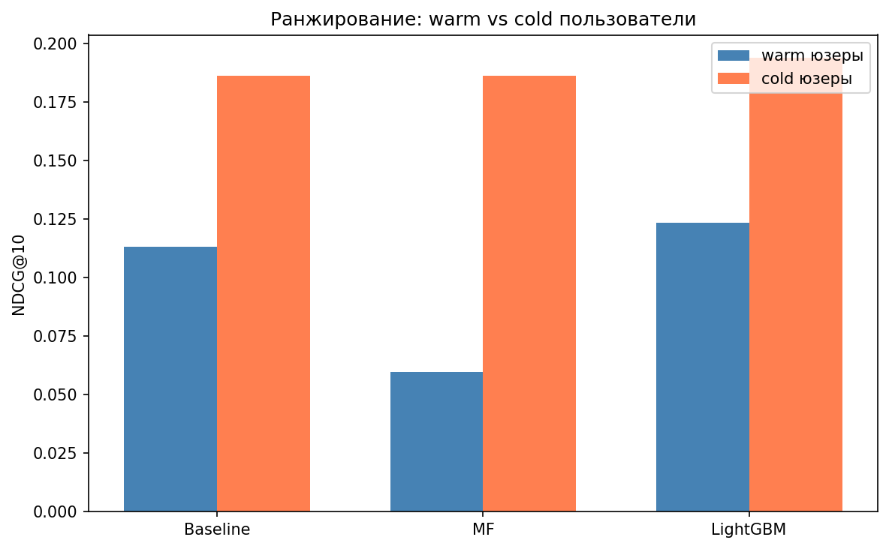
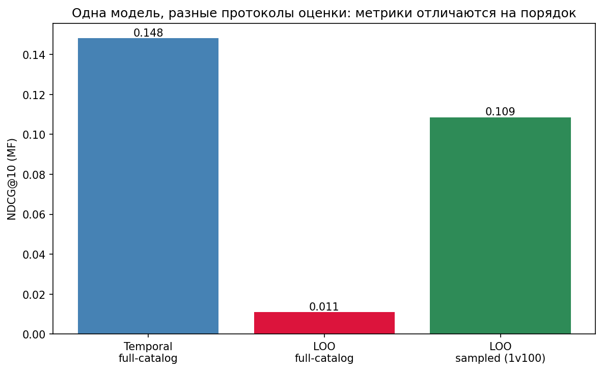
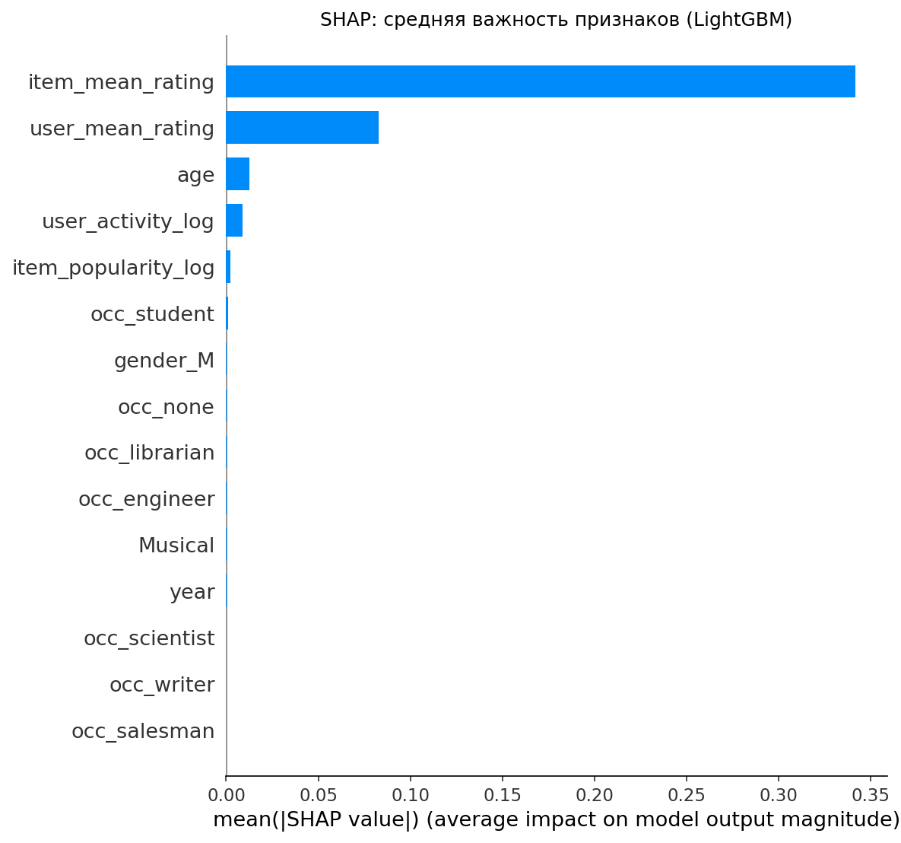
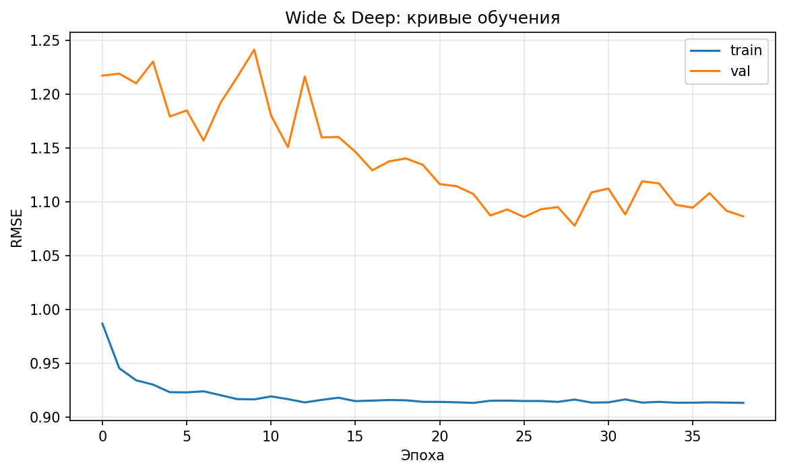

# Рекомендательная система фильмов (MovieLens 100K)

Учебно-исследовательский проект: пошаговое построение рекомендательной системы от простых бейзлайнов до нейросетевых и ранжирующих моделей. Основной фокус не на достижении максимальной метрики, а на честной методологии оценки и на понимании, почему на реалистичном временном разбиении простые бейзлайны трудно превзойти.

## Ключевая идея проекта

Данные разбиваются по времени (temporal split), а не случайно. Это моделирует реальную работу продакшена: обучаемся на прошлом, предсказываем будущее. Такое разбиение обнажает главную проблему рекомендаций, которую случайное разбиение скрывает: **cold start**. При temporal split около 85% тестовых оценок принадлежат пользователям, которых нет в обучающей выборке. Для них коллаборативные методы не имеют истории и вынужденно откатываются на константу.

Весь проект показывает, как разные семейства моделей ведут себя в этих условиях, и почему выбор метрики и схемы оценки влияет на выводы не меньше, чем выбор модели.

## Данные

- MovieLens 100K: 100000 оценок, 943 пользователя, 1682 фильма
- Разреженность матрицы оценок около 93.7%
- Оценки по шкале 1-5, распределение смещено вправо (среднее около 3.5)
- Ярко выраженный long tail: небольшое число фильмов собирает большинство оценок

## Методология

- **Temporal split** по времени против утечки данных. В ноутбуках 02-05 использовалось разбиение 80/20, в ноутбуках 06-07 оно уточнено до 70/10/20 с отдельной валидацией для подбора гиперпараметров.
- Все статистики (средние по фильмам и пользователям, популярность) считаются только на train и замораживаются. Val и test их только читают.
- Тестовая выборка используется один раз, в самом конце, для финальной оценки. Подбор гиперпараметров идёт только по валидации.
- Фиксация seed для воспроизводимости.
- Early stopping по валидации для нейросетевых моделей и градиентного бустинга.

## Структура проекта

| Ноутбук | Содержание |
|---|---|
| 01_eda | Разведочный анализ: разреженность, смещение оценок, long tail, cold start |
| 02_baselines | Бейзлайны: global mean, user mean, item mean |
| 03_memory_based_cf | User-based и item-based коллаборативная фильтрация |
| 04_matrix_factorization | Матричная факторизация на PyTorch (эмбеддинги, bias, global mean) |
| 05_neural_cf | Neural CF (эмбеддинги, MLP), тюнинг через Optuna |
| 06_content_based | Content-based модели, решающие cold start: Ridge, RandomForest, GradientBoosting, LightGBM, Wide & Deep, анализ через SHAP |
| 07_ranking | Ранжирующие метрики, сравнение temporal и LOO, sampled evaluation, learning-to-rank |

## Результаты: предсказание оценки (RMSE)

Метрика RMSE на тесте. Чем ниже, тем лучше. Item mean baseline это сильный ориентир, который почти никто не превосходит на общем тесте из-за cold start.

| Модель | Test RMSE | Комментарий |
|---|---|---|
| Global mean | 1.1191 | Константа |
| User mean | 1.1258 | Хуже global mean: 85% тестовых юзеров новые |
| Item mean | 1.0367 | Сильнейший baseline |
| User-based CF | 1.1034 | Не бьёт baseline из-за cold start |
| Item-based CF | 1.1158 | То же |
| Matrix Factorization | 1.1085 | На покрытых парах val около 0.98, на всём тесте откат на global mean |
| Neural CF | 1.1185 | Optuna выбрала неглубокую сеть |
| Ridge | 1.0507 | Content-based |
| RandomForest | 1.0526 | Content-based |
| GradientBoosting | 1.0437 | Content-based |
| LightGBM | 1.0400 | Лучшая среди content-based |
| Wide & Deep | 1.0660 | Худшая: переобучение на табличных данных |

Примечание: значения RMSE у моделей из ноутбуков 02-05 и 06-07 не полностью сопоставимы напрямую, так как обучались на разных вариантах разбиения (80/20 против 70/10/20). Внутри каждой группы сравнение корректно.

## Результаты: ранжирование

Для рекомендаций важнее не точность балла, а качество топ-K списка. Метрики (Precision, Recall, NDCG, MAP, MRR) считались при temporal split на едином пуле кандидатов (фильмы с не менее чем 20 оценками), релевантным считался фильм с оценкой не ниже 4.

Ключевые наблюдения:

- На едином пуле кандидатов LightGBM превосходит неперсонализированный baseline по NDCG и MRR: контентная персонализация работает.
- Matrix Factorization в среднем близок к baseline. Разбивка на warm и cold пользователей показала, что на warm пользователях MF превосходит baseline (персонализация работает), а на cold пользователях он тождественно равен baseline из-за отката.
- Обнаружен неочевидный эффект: cold пользователи получают более высокие метрики, чем warm. Новые пользователи оценивают преимущественно популярные фильмы, которые baseline и так рекомендует, тогда как у давних пользователей вкус специфичен и его труднее угадать.

## Методология оценки: temporal, LOO, sampled

Отдельный блок исследования показывает, что абсолютные значения метрик определяются не только моделью, но и протоколом оценки:

- **Temporal full-catalog**: NDCG@10 около 0.16. Много релевантных фильмов на пользователя, но присутствует cold start.
- **LOO full-catalog**: NDCG@10 около 0.01. Один спрятанный релевантный фильм ранжируется против всего каталога, самая строгая постановка.
- **LOO sampled (1 против 100 негативов)**: NDCG@10 около 0.11, в 10 раз выше full-catalog при той же модели.

Вывод: метрики из разных работ несопоставимы без учёта протокола. Sampled evaluation, распространённый в исследованиях, даёт числа на порядок выше, чем честная оценка по полному каталогу.

## Content-based модели и анализ признаков

Content-based подход решает item cold start, потому что жанры и год известны для нового фильма без единой оценки. Анализ важности признаков через SHAP показал, что практически весь предсказательный сигнал сосредоточен в двух признаках: среднем рейтинге фильма и среднем рейтинге пользователя. Демографические и жанровые признаки почти не влияют на итоговую метрику.

Wide & Deep, самая сложная из моделей, показала худший RMSE из-за переобучения: на табличных данных с малым числом информативных признаков нейросеть подгоняется под шум обучающей выборки, что видно по разрыву между train и val.

## Learning-to-Rank

LGBMRanker (обучение напрямую на ранжирование) уступил обычному LGBMRegressor. Причина в том, что ranker обучается упорядочивать уже просмотренные пользователем фильмы, тогда как на тесте нужно ранжировать незнакомый каталог. Для корректной работы learning-to-rank требуется negative sampling.

Negative sampling сознательно не реализован из-за противоречивости подхода на данных с implicit feedback: он вносит проблему ложных негативов (отсутствие оценки не означает нерелевантность), может усиливать popularity bias и требует аккуратного контроля против утечки. Подход зафиксирован как направление для развития, а не как механический приём улучшения метрик.

## Объяснение ключевых результатов

**Почему модели опираются в основном на средний рейтинг фильма.** Анализ важности признаков (SHAP, корреляции, прямой эксперимент) показал, что практически весь предсказательный сигнал сосредоточен в двух признаках: среднем рейтинге фильма (item_mean_rating) и среднем рейтинге пользователя (user_mean_rating). Это не утечка: средний рейтинг фильма это сильнейший предиктор оценки, потому что он отражает объективное качество фильма, одинаково воспринимаемое большинством пользователей. Жанры и демография добавляют мало информации поверх этих средних, так как средний рейтинг фильма уже неявно вобрал в себя его жанровые характеристики (ужасы как и комедии часто имеют низкий рейтинг, фантастика и триллеры - высокий). Модель рационально игнорирует слабые признаки: эксперимент подтвердил, что LightGBM на двух признаках даёт тот же RMSE (1.03996), что и на всех 47 (1.04000).

**Отсутствие утечки данных.** Все средние считаются строго на обучающей выборке и замораживаются, валидация и тест их только читают. Признак item_mean_rating это среднее по другим пользователям из train, а не по предсказываемой оценке, поэтому его использование корректно и лежит в основе большинства рекомендательных бейзлайнов. Косвенное подтверждение отсутствия утечки это честный RMSE около 1.04: при утечке метрика была бы близка к нулю.

**Почему разбиение по времени было единственно правильным.** Датасет содержит временные метки, а рекомендательная система в реальности всегда работает по принципу "обучаемся на прошлом, предсказываем будущее". Случайное разбиение нарушило бы этот принцип: модель обучалась бы на будущих оценках пользователя и предсказывала прошлые, что создаёт утечку времени и завышает метрики. Temporal split честнее отражает продакшен и обнажает cold start (около 85% тестовых пользователей новые), который случайное разбиение полностью скрывает. Поэтому именно временная разбивка, а не случайная, корректна для этой задачи.

**Почему использован RMSE, и почему затем выполнен переход к ранжированию.** RMSE выбран первой метрикой сознательно. Датасет содержит явные оценки (рейтинги 1-5), поэтому естественная первая задача это регрессия, точность которой измеряется RMSE. Метрика проста, считается мгновенно и позволяет быстро сравнить все семейства моделей на едином основании. Кроме того, именно на RMSE нагляднее всего проявляется cold start: user mean оказывается хуже global mean, коллаборативная фильтрация не превосходит бейзлайн, матричная факторизация на всём тесте откатывается на константу. RMSE выступил быстрым и честным диагностическим инструментом, задающим базовую картину.

**Однако RMSE измеряет не то, что важно для рекомендательной системы.** Пользователю не важно, предскажет ли модель балл 3.8 вместо 4.0, ему важно, какие фильмы окажутся в топе списка. Модель может иметь хороший RMSE, но плохо ранжировать, и наоборот. Рекомендация это задача ранжирования (показать лучшие K фильмов), а не точного предсказания балла. Поэтому был выполнен переход к ранжирующим метрикам (NDCG, MAP, MRR), которые оценивают именно качество топа. Сам контраст между RMSE и ранжированием стал результатом: на RMSE модели почти неотличимы от бейзлайна из-за cold start, а ранжирующие метрики показали, что персонализация всё же работает на пользователях с историей.
 
**Почему честное ранжирование на этом датасете принципиально трудно**. MovieLens 100K это разреженная матрица (заполнено около 6% пар пользователь-фильм) с явными оценками, и это накладывает фундаментальные ограничения на ранжирование, не связанные с качеством моделей. Во-первых, ранжирование по полному каталогу требует угадать несколько релевантных фильмов среди примерно 1600, что при разреженных данных объективно трудно, поэтому абсолютные значения метрик закономерно невелики. Во-вторых, явные оценки редки и смещены: пользователи оценивают в основном то, что уже выбрали смотреть, а подавляющее большинство потенциальных взаимодействий остаётся без оценки, что не даёт полноценного сигнала для обучения ранжированию. В-третьих, при честном temporal split около 85% тестовых пользователей новые, и для них персонализация структурно невозможна независимо от модели.

## Главные выводы

1. При честном temporal split простые бейзлайны (особенно item mean) очень трудно превзойти. Главный сигнал, средний рейтинг фильма, они уже используют, а для новых пользователей информации структурно недостаточно.
2. Сложность модели не гарантирует лучший результат. На табличных данных с малым числом информативных признаков градиентный бустинг превосходит нейросети, а самая сложная модель (Wide & Deep) показала худший RMSE из-за переобучения.
3. Content-based подход решает item cold start (жанры и год известны для нового фильма), но не решает user cold start: демография оказалась слишком слабым сигналом, чтобы заменить историю оценок.
4. Общая метрика (RMSE или усреднённый NDCG) маскирует поведение модели на подгруппах. Разбивка на warm и cold, а также сравнение протоколов оценки, показывают гораздо больше, чем одно агрегированное число.
5. Основное узкое место рекомендаций на этих данных не мощность модели, а cold start и дрейф предпочтений во времени.

## Направления для развития

- Two-tower архитектура с признаковыми башнями для retrieval на масштабе. Матричная факторизация в проекте это по сути two-tower с id-эмбеддингами; полная версия с признаковыми башнями решала бы cold start за счёт признаков.
- Переход на implicit feedback (клики, просмотры) вместо явных оценок.
- Learning-to-rank с корректным negative sampling.
- Признаки с временным затуханием против дрейфа предпочтений.
- Сбор нескольких оценок при онбординге как продуктовое решение user cold start.

## Технологии

Python, pandas, numpy, scikit-learn, PyTorch, LightGBM, Optuna, SHAP, matplotlib.

## Как запустить

1. Скачать MovieLens 100K и распаковать в `data/ml-100k/`.
2. Установить зависимости: `pip install pandas numpy scikit-learn torch lightgbm optuna shap matplotlib`.
3. Запускать ноутбуки по порядку от 01 до 07. Ноутбук 04 сохраняет веса MF, которые могут использоваться далее.
